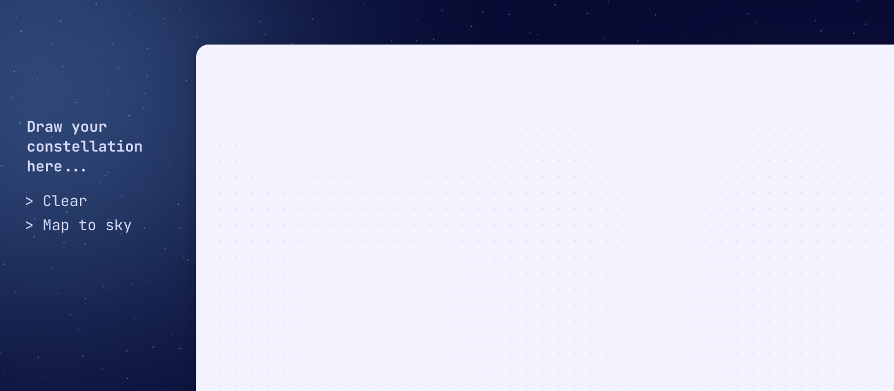
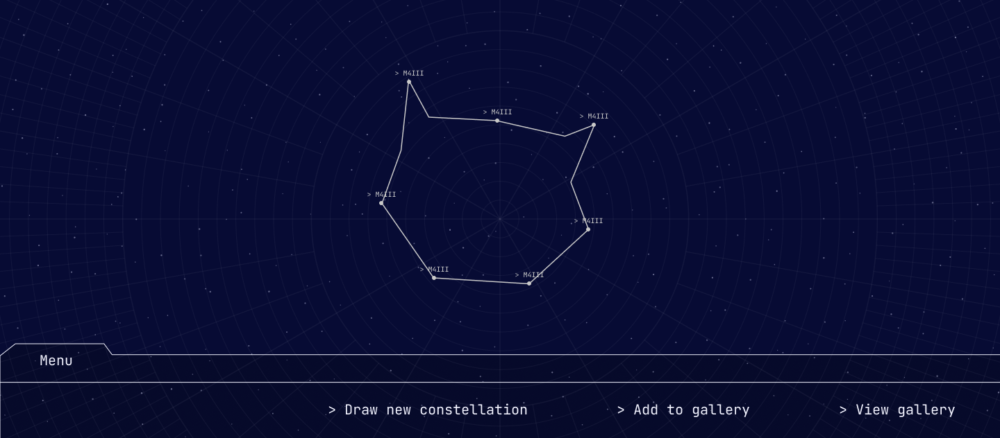

# Constellation Creator

Constellation Creator merges art and astronomy, transforming user sketches into personalized celestial formations based on time and location. With an intuitive React frontend for creation and a Node.js backend for storage, it provides a cosmic gallery for users to explore their unique creations.

